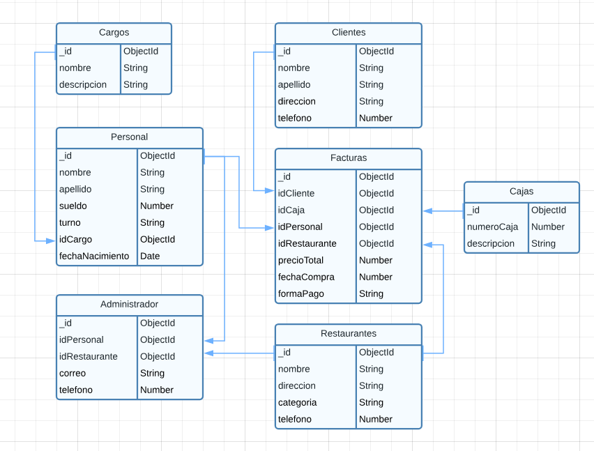
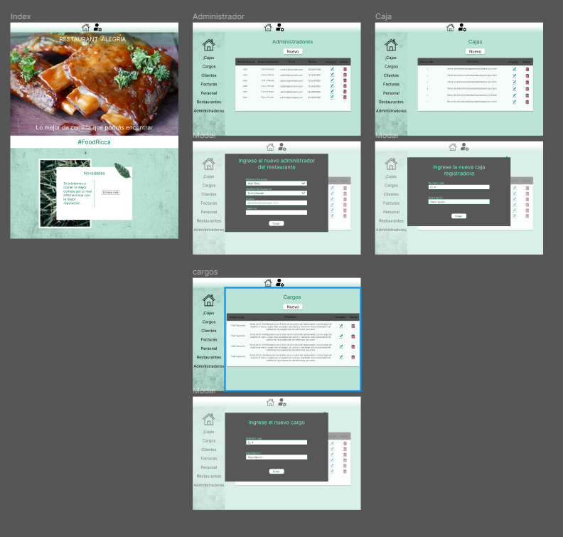

# Restaurante alegria - Aplicativo con backend y frontend

Esta aplicación está diseñada para un restaurante llamado Alegria, y le permite gestionar y administrar detalladamente los registros de sus diferentes sucursales. Fue desarrollada utilizando Node.js, Express.js y React.js, y utiliza MongoDB para el manejo de datos. Esta aplicación le permite administrar empleados (personal), cargos de empleados, clientes, restaurantes (sucursales), administradores de restaurantes (sucursales), cajas de venta y de manera eficiente, gestionar la información relacionada con los cargos de los empleados

### Funcionalidades

- Gestión de Clientes: Permite agregar, editar, listar y eliminar a los clientes que consumen alimentos en estos restaurantes.

- Gestión de Restaurantes: Permite agregar, editar, listar y eliminar restaurantes (sucursales), cada uno con su respectiva categoría, para un control preciso de la operación.

- Gestión de Empleados (Personal): Permite agregar, editar, listar y eliminar empleados, manteniendo un registro completo de la nómina de personal.

- Gestión de Cargos: Permite agregar, editar, listar y eliminar cargos de empleados. Se divide en secciones para brindar especificidad en cada área, dada la alta calidad de los productos (comida) ofrecidos.

- Gestión de Cajas de Venta: Permite agregar, editar, listar y eliminar cajas de venta, garantizando un control exhaustivo de los ingresos en cada restaurante.

- Gestión de Administradores: Permite agregar, editar, listar y eliminar administradores. Esta función permite designar la persona responsable de dirigir a los empleados y representar al restaurante.

- Gestión de Facturas: Permite agregar, editar, listar y eliminar facturas. Facilita un seguimiento detallado de las transacciones, incluyendo quién compró, cómo lo hizo y quién realizó la venta.

### Modelo Relacional

En este apartado, podrás visualizar todas las colecciones junto con sus respectivas relaciones de una manera gráfica y altamente intuitiva para facilitar su comprensión

### Diseño Figma
[Clic al Figma](https://www.figma.com/file/Lgte2Qb2xjiyfdK1oQRb5r/Untitled?type=design&node-id=0%3A1&mode=design&t=1hdKNDpp3BkHio9t-1)

